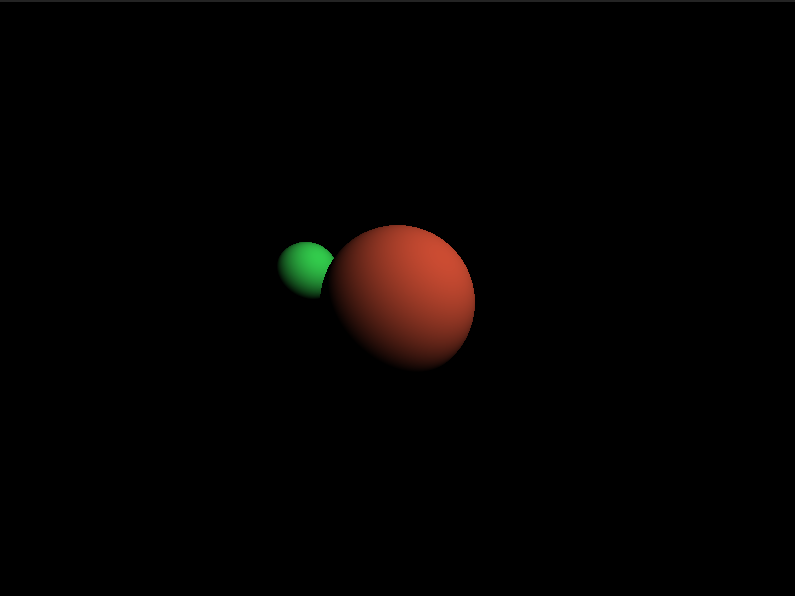

## simple ray tracer implemented with CUDA for parallel rendering of 3D scenes on the GPU



## Overview

This project implements a basic ray tracer using CUDA for parallel processing. The ray tracer can render spheres with basic diffuse lighting in a 3D scene, generating an image in PPM format.

### GPU Optimizations

The code uses several GPU-specific optimization techniques:

```cpp
__device__ float min_no_branch(float a, float b) { return a + ((b - a) * (b < a)); }

__device__ float max_no_branch(float a, float b) { return a + ((b - a) * (a < b)); }

__device__ float clamp_no_branch(float v, float min_v, float max_v) { return min_no_branch(max_no_branch(v, min_v), max_v); }
```

These functions implement conditional operations without using branch instructions (no `if` statements), which significantly improves performance on GPUs where different threads in a warp execute the same code.

### Ray-Sphere Intersection Calculation

Collision detection between a ray and a sphere is a fundamental part of ray tracing:

```cpp
__device__ HitRecord intersectRaySphere(const Ray& ray, const Sphere& sphere, int index) {
    // code that implements the quadratic equation to find intersections
    // between a ray and a sphere
}
```

This function solves the quadratic equation to determine if a ray intersects a sphere, and if so, calculates the intersection point and the surface normal at that point.

### Lighting Calculation

The diffuse lighting model is implemented in a simple way:

```cpp
__device__ float3 calculateDiffuseLight(const float3& hitPoint, const float3& normal, const float3& sphereColor, const Light& light) {
    float3 lightDir = normalize(light.position - hitPoint);
    float diffuseFactor = max_no_branch(0.0f, dot(normal, lightDir));
    return sphereColor * light.color * diffuseFactor;
}
```

This code calculates the diffuse light contribution at a point, taking into account the light direction and the surface normal.

### CUDA Kernel

The main ray tracer kernel runs in parallel for each pixel in the image:

```cpp
__global__ void raytraceKernel(uchar4* outputBuffer, int width, int height, SceneData scene) {
    // calculate pixel coordinates
    // generate a ray from the camera
    // check intersections with scene objects
    // calculate pixel color based on lighting
}
```

Each GPU thread processes one pixel of the final image, allowing for high parallelism.

## How to Compile and Run

### Prerequisites

- CUDA Toolkit (10.0 or higher)
- C++ compiler compatible with C++11 or higher
- Updated NVIDIA driver

### Compilation

To compile the project, use the following command:

```bash
nvcc -std=c++11 -o raytracer raytracer.cu
```

### Execution

Run the compiled program:

```bash
./raytracer
```

The program will generate an output file called `output.ppm` in the current directory.

## Viewing the Result

The PPM format can be viewed by many common image viewers. Alternatively, you can convert the PPM file to a more common format like PNG or JPEG using tools such as:

- ImageMagick: `convert output.ppm output.png`
- GIMP
- Photoshop

## Modifying the Scene

You can easily modify the scene by changing the values in the `main()` block:

```cpp
SceneData scene;
scene.numSpheres = 2;
scene.spheres[0] = { make_float3(0, 0, -2), 1.0f, make_float3(0.8f, 0.3f, 0.2f) };
scene.spheres[1] = { make_float3(-1.5f, 0.5f, -3), 0.5f, make_float3(0.2f, 0.8f, 0.3f) };
scene.light = { make_float3(5, 5, 5), make_float3(1, 1, 1) };
scene.camera = { make_float3(0, 0, 2), 60.0f };
```

For each sphere, you can define:

- position (center): `make_float3(x, y, z)`
- radius (radius): a float value
- color (color): `make_float3(r, g, b)` with values from 0.0 to 1.0

You can add up to 10 spheres (defined by `MAX_SPHERES`).

## Limitations and Possible Improvements

- only supports spherical objects
- implements only basic diffuse lighting
- does not support shadows, reflections, or refractions
- limited to a fixed resolution (800x600)
- does not implement anti-aliasing techniques